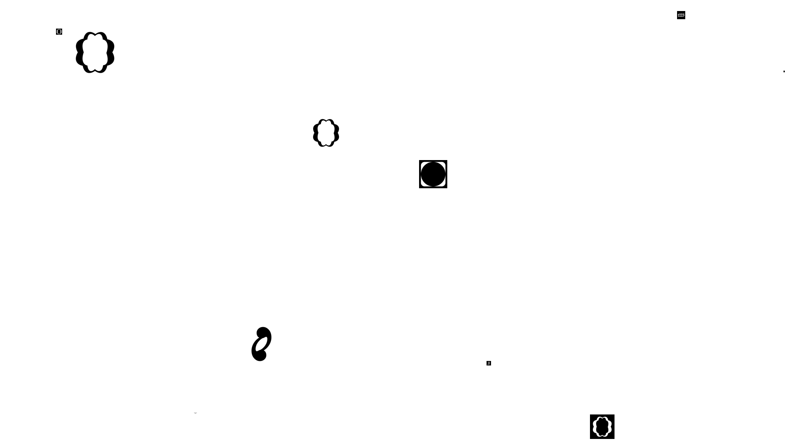
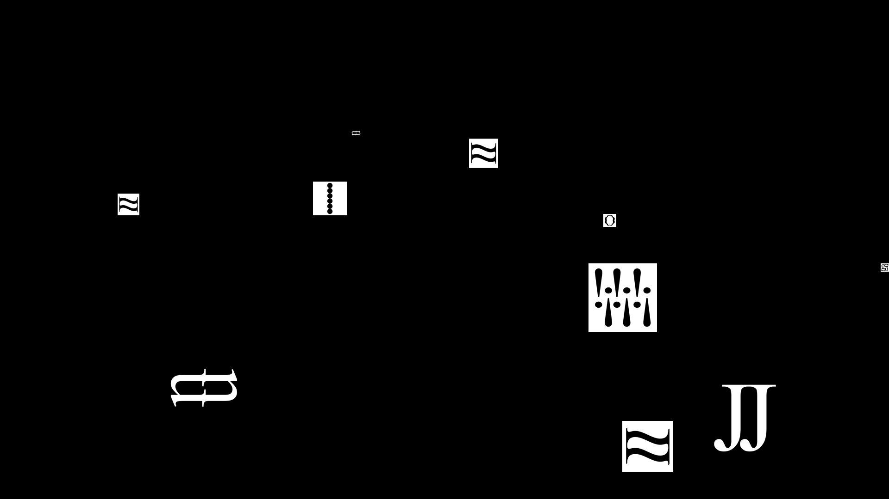

# Type Your Words !

## About ..
Project ***Type Your Words*** is an interactive Django website where users can create their own unique designs using the AMHO. AMHO is a new set of alphabet / language designed to become a visual representation of the input. It veils the content and allows the narrative to be communicated through image. The project came from the idea of digital communication and the overwhelming content on the internet. To drag off the weight that word could hold, image is used instead to carry the narrative. We wish the users could use our site to scream off without the pressure of being read but seen. Explore the process of transformation from word to image.

## Creators

- Yoon Joo Cho

<em>Yoon Joo Cho</em>

Graphic Designer. Student at Maryland Institute College of Art. View more of her work at [@yoon.joo.cho](https://www.instagram.com/yoon.joo.cho/)

- Jeongin Lee

<em>Jeongin Lee</em>

Web Developer. Student at NYU Abu Dhabi. View more of her projects at [GitHub](https://github.com/jjeongin) and [LinkedIn](https://www.linkedin.com/in/jeongin-lee-4687401b3/).
